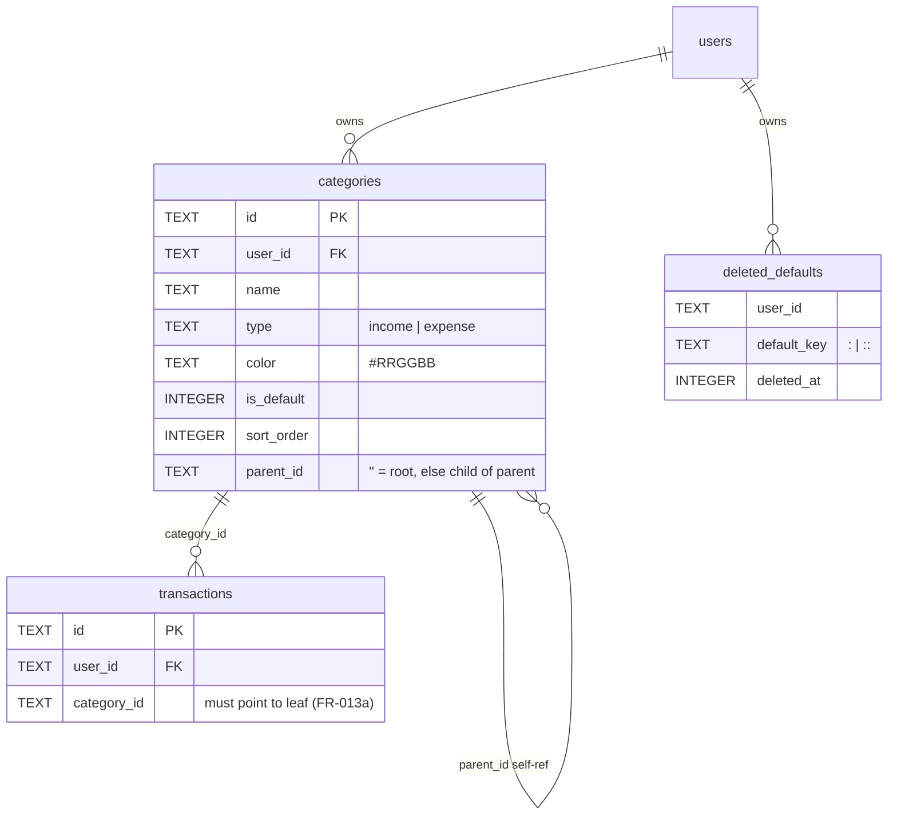

# Phase 1 資料模型：分類系統（Category System）

**Branch**: `003-categories`｜**Date**: 2026-04-25｜**Plan**: [plan.md](./plan.md)

## §1 表結構與欄位

### 1.1 `categories`（既有，本計畫修改）

| 欄位 | 型別 | 約束 | 對應 FR | 備註 |
| --- | --- | --- | --- | --- |
| `id` | TEXT | PRIMARY KEY | — | uid()；既有 |
| `user_id` | TEXT | NOT NULL | FR-002 | 既有；分類隸屬使用者 |
| `name` | TEXT | NOT NULL | FR-002 | 既有 |
| `type` | TEXT | NOT NULL CHECK(`type` IN ('income','expense')) | FR-003、FR-014c | 既有；建立後**永久不可變**（後端 update 路徑禁止接受 `type`） |
| `color` | TEXT | DEFAULT `'#6366f1'` | FR-002、FR-020 | 既有；後端驗證 `/^#[0-9A-Fa-f]{6}$/` |
| `is_default` | INTEGER | DEFAULT 0 | FR-002、FR-009、FR-009a | 既有；純資訊旗標，無行為差異 |
| `sort_order` | INTEGER | DEFAULT 0 | FR-002、FR-024 | 既有；同層排序鍵 |
| `parent_id` | TEXT | DEFAULT `''` | FR-002、FR-001、FR-006 | 既有；空字串=父分類，非空=子分類；FR-001 強制兩層（拒絕「`parent_id` 指向另一個 `parent_id != ''` 的分類」） |
| ~~`is_hidden`~~ | ~~INTEGER~~ | ~~既有~~ | FR-002（**移除**） | **本計畫於 migration 中刪除** |

**索引**：

- 既有：`idx_tx_user_cat ON transactions(user_id, category_id)`（為刪除規則
  服務，已存在）。
- **新增**：`idx_cat_user_parent_sort ON categories(user_id, parent_id, sort_order)`
  ——加速分類管理頁列表查詢與拖曳重排。
- **新增**：`idx_cat_user_type ON categories(user_id, type)` ——加速
  雙區塊分頁渲染（先 expense 後 income）。

**唯一性約束**（應用層強制，無 DB 等級 UNIQUE）：

- 父分類：`(user_id, type, name)` 唯一（FR-005a）。
- 子分類：`(user_id, parent_id, name)` 唯一（FR-005）。

> 不在 DB 層加 UNIQUE 是因為 sql.js 表結構已固定，加 UNIQUE 需 rebuild；
> 應用層每次 INSERT/UPDATE 都會 SELECT 比對，效能可接受（<30/<200 筆/使用者）。

### 1.2 `deleted_defaults`（**新增**）

| 欄位 | 型別 | 約束 | 對應 FR | 備註 |
| --- | --- | --- | --- | --- |
| `user_id` | TEXT | NOT NULL | FR-011b | 與 `users.id` 邏輯關聯 |
| `default_key` | TEXT | NOT NULL | FR-011b | 預設分類穩定識別字串 |
| `deleted_at` | INTEGER | DEFAULT 0 | — | 寫入時 `Date.now()`，僅供稽核 |
| **PRIMARY KEY** | — | (`user_id`, `default_key`) | — | 確保冪等寫入；`INSERT OR REPLACE` 安全 |

**`default_key` 編碼規則**：

- 父分類：`<type>:<name>`，例 `expense:餐飲`、`income:薪資`、`expense:其他`、`income:其他`（type 區分跨類型同名）。
- 子分類：`<type>:<parent_name>:<name>`，例 `expense:餐飲:早餐`、`income:薪資:月薪`。

**索引**：

- 既有：PK 已涵蓋查詢需求。
- **新增**：無（PK = `(user_id, default_key)` 已是唯一查詢路徑）。

### 1.3 `transactions`（既有，本計畫**僅補應用層 leaf-only 驗證**）

無 schema 變更；於 `POST /api/transactions` 與 `PATCH /api/transactions/{id}`
驗證 `category_id` 對應的 row `parent_id != ''`（即必為子分類，FR-013a）。

## §2 實體關係圖（mermaid）



## §3 Migration 步驟

> 觸發點：server.js `initDatabase()` 既有 try/catch pattern；新增 `migrateTo003()`
> 函式於 `migrateDefaultSubcategories()`（將被改名為 `backfillDefaultsForUser`）
> 之前呼叫一次。

### 3.1 移除 `categories.is_hidden` 欄位（CT-1 對應）

```sql
-- 偵測：若 categories 表仍有 is_hidden，執行 rebuild
PRAGMA table_info(categories);
-- 若回傳列含 name='is_hidden'：

BEGIN;
CREATE TABLE categories_new (
  id TEXT PRIMARY KEY,
  user_id TEXT NOT NULL,
  name TEXT NOT NULL,
  type TEXT NOT NULL CHECK(type IN ('income','expense')),
  color TEXT DEFAULT '#6366f1',
  is_default INTEGER DEFAULT 0,
  sort_order INTEGER DEFAULT 0,
  parent_id TEXT DEFAULT ''
);
INSERT INTO categories_new (id, user_id, name, type, color, is_default, sort_order, parent_id)
  SELECT id, user_id, name, type, color, is_default, sort_order, parent_id
  FROM categories;
DROP TABLE categories;
ALTER TABLE categories_new RENAME TO categories;
CREATE INDEX IF NOT EXISTS idx_cat_user ON categories(user_id);
CREATE INDEX IF NOT EXISTS idx_cat_user_parent_sort ON categories(user_id, parent_id, sort_order);
CREATE INDEX IF NOT EXISTS idx_cat_user_type ON categories(user_id, type);
COMMIT;
```

**回滾**：migration 前 `database.db` 已自動備份至
`database.db.bak.<timestamp>.before-003`（複用 002 既有備份機制）。失敗時：
停服 → `cp database.db.bak.<timestamp>.before-003 database.db` → 重啟。

### 3.2 建立 `deleted_defaults` 表

```sql
CREATE TABLE IF NOT EXISTS deleted_defaults (
  user_id TEXT NOT NULL,
  default_key TEXT NOT NULL,
  deleted_at INTEGER DEFAULT 0,
  PRIMARY KEY (user_id, default_key)
);
```

**初始狀態**：空（首版上線無歷史「使用者主動刪除預設分類」事件可遷移）。

### 3.3 新增索引

於 `initDatabase()` 既有 `db.run("CREATE INDEX IF NOT EXISTS …")` 區段新增：

```sql
CREATE INDEX IF NOT EXISTS idx_cat_user_parent_sort ON categories(user_id, parent_id, sort_order);
CREATE INDEX IF NOT EXISTS idx_cat_user_type ON categories(user_id, type);
```

### 3.4 預設樹補建（升級既有使用者）

於 `initDatabase()` 末段（既有 `migrateDefaultSubcategories()` 呼叫位置）
改為呼叫新版 `backfillDefaultsForAllUsers()`：

```js
function backfillDefaultsForAllUsers() {
  const users = queryAll("SELECT DISTINCT user_id FROM categories");
  users.forEach(({ user_id }) => backfillDefaultsForUser(user_id));
  // 同步補建那些「沒有任何分類」的使用者（理論上不會發生，但做防禦）
  // — 不做；若使用者完全空樹，應由 createDefaultsForUser 處理。
}

function backfillDefaultsForUser(userId) {
  const deletedSet = new Set(
    queryAll("SELECT default_key FROM deleted_defaults WHERE user_id = ?", [userId])
      .map(r => r.default_key)
  );
  let maxOrder = queryOne(
    "SELECT COALESCE(MAX(sort_order),0) AS m FROM categories WHERE user_id = ?",
    [userId]
  )?.m || 0;

  // 遍歷 expense, income 兩個 type
  for (const type of ['expense', 'income']) {
    const parents = (type === 'expense' ? DEFAULT_EXPENSE_PARENTS : DEFAULT_INCOME_PARENTS);
    for (const [pName, pColor] of parents) {
      const pKey = `${type}:${pName}`;
      if (deletedSet.has(pKey)) continue; // FR-011c：跳過使用者主動刪除過的

      // 父分類存在性檢查（FR-011a：以 (user_id, type, name) 為鍵；parent 範疇即 parent_id=''）
      let parent = queryOne(
        "SELECT id FROM categories WHERE user_id = ? AND type = ? AND name = ? AND parent_id = ''",
        [userId, type, pName]
      );
      if (!parent) {
        const pid = uid();
        maxOrder++;
        db.run(
          "INSERT INTO categories (id, user_id, name, type, color, is_default, sort_order, parent_id) VALUES (?,?,?,?,?,1,?,'')",
          [pid, userId, pName, type, pColor, maxOrder]
        );
        parent = { id: pid };
      }

      // 子分類補建
      const subs = (DEFAULT_SUBCATEGORIES[type] || {})[pName] || [];
      for (const [sName, sColor] of subs) {
        const sKey = `${type}:${pName}:${sName}`;
        if (deletedSet.has(sKey)) continue; // FR-011c

        // FR-011a：以 (user_id, parent_id, name) 為鍵
        const exists = queryOne(
          "SELECT id FROM categories WHERE user_id = ? AND parent_id = ? AND name = ?",
          [userId, parent.id, sName]
        );
        if (exists) continue; // 跳過、不覆寫

        maxOrder++;
        db.run(
          "INSERT INTO categories (id, user_id, name, type, color, is_default, sort_order, parent_id) VALUES (?,?,?,?,?,1,?,?)",
          [uid(), userId, sName, type, sColor, maxOrder, parent.id]
        );
      }
    }
  }
}
```

**冪等性保證**（FR-010、SC-005）：

- 每次呼叫先查 `deleted_defaults` → 跳過；
- 再查 `categories` 既有名稱 → 跳過；
- 只 INSERT 真正缺漏的；同一使用者重複呼叫 N 次，第 1 次 INSERT 後第 2~N 次
  皆為純 SELECT，無 INSERT，無副作用。

**P95 ≤ 200ms 保證**（FR-010a、SC-007）：

- 13 父 + 56 子 = 69 個比對單元；每單元最多 1 SELECT + 0~1 INSERT，全部
  於同一 sql.js 記憶體交易中；本機 benchmark 預期 < 50ms。

## §4 操作語意（state transitions）

### 4.1 新增父分類（POST /api/categories）

```text
請求 → 驗證 color #RRGGBB → 驗證 (user_id, type, name) 唯一（FR-005a）
     → 驗證 parentId 為空或對應的父分類存在且 type 一致（FR-004）
     → INSERT；sort_order = MAX(sort_order)+1
     → 200 { id }
```

### 4.2 編輯分類（PUT /api/categories/{id}）

```text
請求 → 驗證 color #RRGGBB
     → 拒絕 body 含 type 欄位（FR-014c：type 不可變）
     → 拒絕將父分類的 parent_id 改為非空（FR-015：防 demote 父→子）
     → 拒絕將子分類的 parent_id 改為空（避免破壞唯一性鍵語意；
        跨父歸屬請走 PATCH，FR-014a）
     → 驗證 (user_id, parent_id, name) 唯一（同層不重名）
     → UPDATE name, color；不更新 type、parent_id、sort_order
     → 200 { ok: true }
```

### 4.3 移動子分類至另一父分類（PATCH /api/categories/{id}）

```text
請求 body: { parentId: <newParentId> }
請求 → 驗證該分類為子分類（即 parent_id != ''；不可對父分類執行）
     → 驗證 newParentId 存在、為使用者擁有、type 與此分類相同（FR-004）
     → 驗證 (user_id, newParentId, name) 唯一（FR-005、FR-016）
     → 驗證新父分類 ≠ 此分類自身（防循環，FR-015）
     → UPDATE parent_id = newParentId,
              sort_order = MAX(sort_order WHERE user_id=? AND parent_id=newParentId)+1
        （FR-014d：移到末端）
     → transactions.category_id 不動（FR-014b）
     → 200 { ok: true }
```

### 4.4 批次重排同層分類（POST /api/categories:reorder）

```text
請求 body: { scope: "parents:expense" | "parents:income" | "children:<parentId>",
             items: [{ id, sortOrder }, ...] }
請求 → 驗證 scope 合法
     → 驗證 items 內所有 id 都屬於同一 scope（即 type+parent_id 一致；
        FR-024b：不可跨層）
     → 驗證所有 id 都歸 user_id 擁有
     → BEGIN; for each: UPDATE categories SET sort_order = ? WHERE id = ? AND user_id = ?; COMMIT
     → 200 { ok: true, updated: N }
```

### 4.5 刪除分類（DELETE /api/categories/{id}）

```text
請求 → 驗證該分類屬使用者
     → 查 transactions WHERE category_id = ? → 若有 → 400（FR-017）
     → 若為父分類：
         → 對每個子分類查 transactions → 任一有 → 400（FR-018）
         → BEGIN
         → 對每個 is_default=1 的子分類，INSERT OR REPLACE INTO deleted_defaults
            (user_id, default_key, deleted_at)（FR-011b1，default_key=
            "<type>:<name>:<sub_name>"）
         → DELETE FROM categories WHERE parent_id = ? AND user_id = ?
         → 若父分類自身 is_default=1，亦寫入 deleted_defaults
            （default_key="<type>:<name>"）
         → DELETE FROM categories WHERE id = ? AND user_id = ?
         → COMMIT
     → 若為子分類：
         → 若 is_default=1，INSERT OR REPLACE INTO deleted_defaults
            （default_key="<type>:<parent_name>:<name>"）
         → DELETE FROM categories WHERE id = ? AND user_id = ?
     → 200 { ok: true }
```

### 4.6 還原預設分類（POST /api/categories:restore-defaults）

```text
請求 → BEGIN
     → DELETE FROM deleted_defaults WHERE user_id = ?
     → backfillDefaultsForUser(userId)  // 不覆寫既有客製化（FR-011e）
     → COMMIT
     → 200 { ok: true, restored: N }   // N = 本次新增的分類數
```

## §5 與既有規格的相容性

- **001-user-permissions**：本計畫的 `user_id` 直接複用 001 已建立的
  `users.id`；不需要新使用者欄位、不影響登入流程（補建在 JWT 簽發後、
  cookie 寫回前同步執行；P95 < 200ms 對登入體感影響 < 5%）。
- **002-transactions-accounts**：本計畫對 `POST /api/transactions` 與
  `PATCH /api/transactions/{id}` 補上 leaf-only 驗證一行；其餘 transaction
  邏輯（樂觀鎖、IDOR、批次操作）完全不影響。`transactions.category_id`
  外鍵語意保持。

## §6 容量規劃

| 量級 | 預估值 | 來源 |
| --- | --- | --- |
| 每使用者父分類 | < 30（預設 13 + 自訂） | spec round 4 報告 deferred 上限 |
| 每使用者子分類 | < 200（預設 56 + 自訂） | 同上 |
| 全表 categories（百人級） | < 30,000 列 | 200 × 百人 + 餘量 |
| `deleted_defaults` 全表 | < 5,000 列 | 預設樹 50 項 × 百使用者 |
| `GET /api/categories` 回應大小 | < 50 KB | 200 列 × ~250 bytes/列（含 JSON 包裝） |
| 補建 SELECT 次數 | ≤ 69 | 13 父 + 56 子 |
| 拖曳重排 UPDATE 次數 | ≤ 30（同層） | 父分類最多 8 個 expense + 5 個 income，子分類最多 5 個 |
